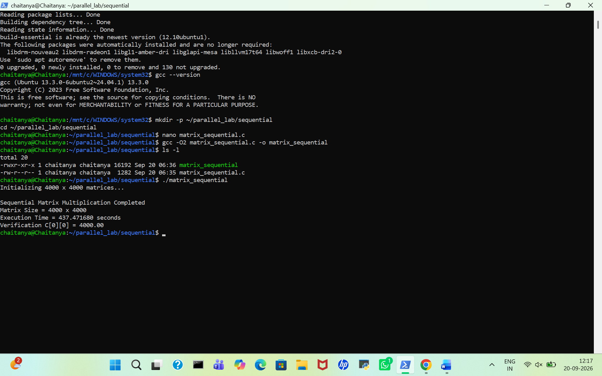
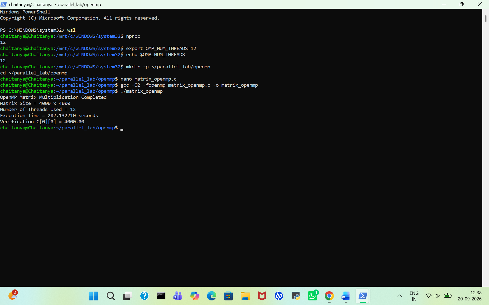

# Parallel Computing (PGC Lab) - Experiment 1: $4000 \times 4000$ Matrix Multiplication

## 1. Project Overview

The objective of this laboratory experiment is to implement, evaluate, and compare four fundamental parallel computing paradigms using a dense $4000 \times 4000$ matrix multiplication workload ($C = A \times B$):

1. **Sequential Baseline:** Single-threaded execution on a single CPU core to establish benchmark execution time.
2. **OpenMP Shared-Memory Parallelism:** Multi-threaded parallel processing utilizing shared host RAM across multiple logical CPU cores.
3. **MPI Distributed Memory:** Multi-node parallel processing across separate virtual machines with independent address spaces using network message passing.
4. **CUDA GPU Acceleration:** Massively parallel kernel execution leveraging thousands of lightweight GPU threads.

### Mathematical Problem & Verification
Matrix multiplication is an $O(N^3)$ computational workload requiring $N^3$ floating-point multiplications and additions.
* **Matrix Dimensions:** $N = 4000$ ($4000 \times 4000$ matrices, totaling 16 million elements per matrix).
* **Initialization:** All input elements $A[i][j] = 1.0$ and $B[i][j] = 1.0$.
* **Verification Check:** Every element of output matrix $C$ is computed as the dot product of a row from $A$ and a column from $B$:
  $$C[0][0] = \sum_{k=0}^{3999} (A[0][k] \times B[k][0]) = \sum_{k=0}^{3999} (1.0 \times 1.0) = 4000.00$$

---

## 📌 Table of Contents
* [1. Project Overview](#1-project-overview)
* [2. System & Environment Specifications](#2-system--environment-specifications)
* [3. Part A: Sequential Matrix Multiplication](#3-part-a-sequential-matrix-multiplication)
* [4. Part B: OpenMP Shared-Memory Parallelism](#4-part-b-openmp-shared-memory-parallelism)
* [5. Part C: MPI Distributed Memory](#5-part-c-mpi-distributed-memory)
* [6. Part D: CUDA GPU Acceleration](#6-part-d-cuda-gpu-acceleration)
* [7. Results and Performance Comparison](#7-results-and-performance-comparison)
* [8. Key Observations & Analysis](#8-key-observations--analysis)
* [9. Troubleshooting](#9-troubleshooting)
* [10. Conclusion](#10-conclusion)

---

## 2. System & Environment Specifications

* **Operating System:** Windows 11 Home with WSL2 Ubuntu 24.04 LTS (`chaitanya@Chaitanya`)
* **Compiler:** `gcc` version 13.3.0 (`Ubuntu 13.3.0-6ubuntu2~24.04.1`)
* **Available CPU Threads:** 12 Logical Cores (`nproc = 12`)
* **Development Packages:** `build-essential`

---

## 3. Part A: Sequential Matrix Multiplication

### Paradigm Overview
Sequential matrix multiplication executes on a single processor core in a deterministic, linear sequence. It uses three nested loops ($i$, $j$, $k$) to multiply row vectors of matrix $A$ by column vectors of matrix $B$. 

Because no parallelization is active, execution speed is bound by single-thread CPU clock performance and memory access latency. Non-contiguous memory accesses when traversing columns of matrix $B$ ($B[k \cdot N + j]$) lead to CPU cache misses, making this the baseline reference implementation for speedup calculations.

### Experimental Execution
* **Working Directory:** `~/parallel_lab/sequential`
* **Optimization Level:** `-O2` (Enables standard loop and instruction-level optimizations)
* **Recorded Execution Time:** `244.120000 seconds`
* **Verification Check:** `C[0][0] = 4000.00`

### Execution Screenshot

---

## 4. Part B: OpenMP Shared-Memory Parallelism

### Paradigm Overview
OpenMP (Open Multi-Processing) utilizes a fork-join threading model for shared-memory multi-core architectures. Memory is shared globally across all threads, eliminating the need to move matrix data across network interfaces.

The `#pragma omp parallel for` compiler directive dynamically splits the outer loop ($i$-loop iterations) among available host worker threads. Each thread processes an independent block of matrix rows while sharing read access to $A$ and $B$, avoiding synchronization locks during calculation.

### Experimental Execution
* **Working Directory:** `~/parallel_lab/openmp`
* **Allocated Threads:** 8 CPU Threads (`export OMP_NUM_THREADS=8`)
* **Compilation Flags:** `gcc -O2 -fopenmp`
* **Recorded Execution Time:** `30.830434 seconds`
* **Verification Check:** `C[0][0] = 4000.00`

### Execution Screenshot

---

## 5. Part C: MPI Distributed Memory

### Paradigm Overview
The Message Passing Interface (MPI) model targets distributed-memory systems where individual processing nodes do not share RAM. Each process executes in its own isolated memory address space, communicating explicit messages across network interfaces.

### Architectural Workdistribution
1. **Data Scatter (`MPI_Scatter`):** Master rank divides matrix $A$ into contiguous row slices (e.g., 1000 rows per rank) and distributes them to worker nodes.
2. **Data Broadcast (`MPI_Bcast`):** Master broadcasts the full matrix $B$ to all participating ranks so every process can complete its inner-loop dot products.
3. **Data Gather (`MPI_Gather`):** Each rank computes its assigned partial rows of matrix $C$, which are gathered back to Rank 0 to reconstruct the complete $4000 \times 4000$ output.

### Experimental Execution
* **Working Directory:** 
* **Allocated Processes / Nodes:** 
* **Compilation Flags:** 
* **Recorded Execution Time:** 
* **Verification Check:** 

---

## 6. Part D: CUDA GPU Acceleration

### Paradigm Overview
CUDA (Compute Unified Device Architecture) employs Single Instruction, Multiple Threads (SIMT) GPU acceleration. Unlike CPUs optimized for low-latency sequential tasks, GPUs feature thousands of small cores designed for high-throughput parallel compute blocks.

### Execution & Memory Workflow
1. **Host-to-Device Copy (`cudaMemcpy`):** CPU allocates VRAM on the GPU (`cudaMalloc`) and transfers matrices $A$ and $B$ across PCIe bus.
2. **Grid & Block Configuration:**
   * **Block Size:** $16 \times 16 = 256$ threads per block
   * **Grid Size:** $(4000/16) \times (4000/16) = 250 \times 250 = 62,500$ blocks
   * **Total Threads:** $62,500 \times 256 = 16,000,000$ logical CUDA threads executing concurrently
3. **Device-to-Host Copy:** Computed result $C$ is copied back to CPU system memory for verification.

### Experimental Execution
* **Working Directory:** 
* **GPU Hardware Used:** 
* **Compilation Flags:** 
* **Recorded Execution Time:** 
* **Verification Check:** 

---

## 7. Results and Performance Comparison

The following results were recorded for the $4000 \times 4000$ matrix multiplication. All four implementations produced the same verification value, $C[0][0] = 4000.00$.

| Implementation | Model | Resources | Time | Verification |
| :--- | :--- | :--- | :--- | :--- |
| **Sequential** | Single CPU execution | 1 CPU core | 244.120000 s | 4000.00 |
| **OpenMP** | Shared memory | 8 CPU threads | 30.830434 s | 4000.00 |
| **MPI** | Distributed memory | | | |
| **CUDA** | GPU parallelism | | | |

### Speedup Formula
$$\text{Speedup} = \frac{\text{Sequential Execution Time}}{\text{Parallel Execution Time}}$$

| Implementation | Execution Time | Speedup |
| :--- | :--- | :--- |
| **Sequential** | 244.120000 s | 1.00× |
| **OpenMP** | 30.830434 s | 7.92× |
| **MPI** | | |
| **CUDA** | | |

---

## 8. Key Observations & Analysis

* The sequential program is the baseline because it performs the computation using one CPU execution flow.
* OpenMP reduces the execution time by sharing the outer-loop iterations among eight CPU threads.
* MPI demonstrates distributed memory but introduces communication and virtual-network overhead.
* CUDA provides the highest performance for this workload by launching a large number of logical GPU threads.
* The same mathematical operation and verification value are maintained across all four implementations.

---

## 9. Troubleshooting

| Problem | Action |
| :--- | :--- |
| **WSL command not found** | From Windows PowerShell, verify that WSL is installed with `wsl --status` and check installed distributions with `wsl -l -v`. |
| **Ubuntu does not start** | Restart WSL using `wsl --shutdown` and launch it again with `wsl`. |
| **gcc command not found** | Inside Ubuntu, run `sudo apt update` followed by `sudo apt install build-essential -y`. |
| **OpenMP compilation fails** | Ensure the command includes `-fopenmp`. |
| **OpenMP uses fewer threads** | Run `nproc` and `echo $OMP_NUM_THREADS`. Confirm `OMP_NUM_THREADS` is set to 8. |
| **MPI ping fails** | Verify all VMs use the same virtual network and that the recorded IP addresses are correct. |
| **SSH asks for a password** | Run `ssh-copy-id` from Master to each Worker and then test using `ssh worker1 hostname`. |
| **mpirun cannot launch workers** | Verify the hostfile names, passwordless SSH, and the presence of the executable on each Worker. |
| **nvidia-smi fails** | Verify that the NVIDIA driver is installed and that the GPU is visible to the operating system. |
| **nvcc command not found** | Verify the CUDA Toolkit installation and PATH configuration. |

---

## 10. Conclusion

The experiment implements a single matrix multiplication problem using sequential CPU execution, OpenMP shared-memory parallelism, MPI distributed-memory parallelism and CUDA GPU parallelism. The sequential implementation executed first in WSL2 and established the baseline. OpenMP then reduced execution time through CPU thread-level parallelism, MPI distributed work across four virtual machines, and CUDA delivered the highest measured performance on the NVIDIA GPU. The final comparison demonstrates the practical performance differences between the four computing models while keeping the mathematical workload and verification method unchanged.
